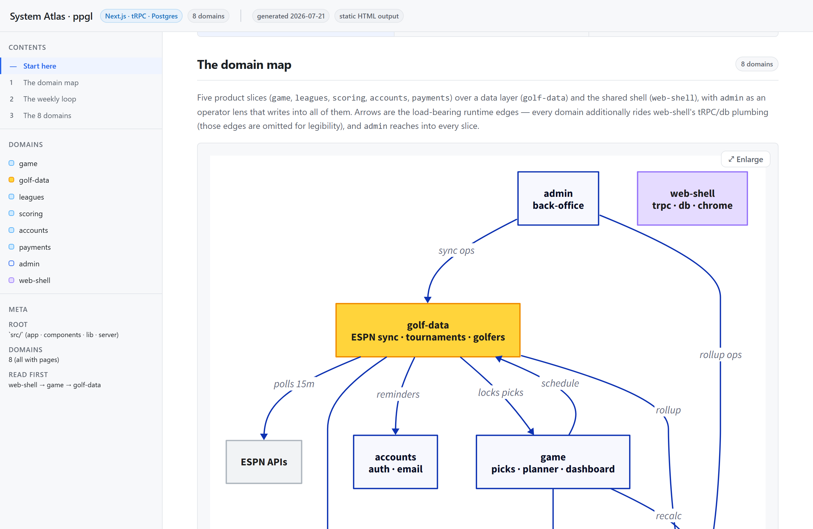
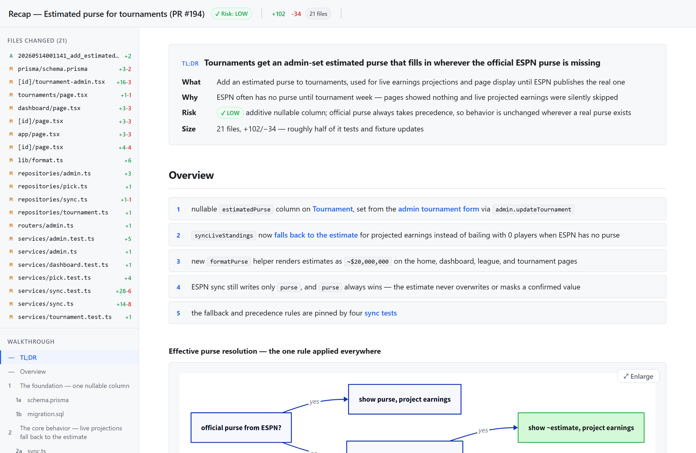
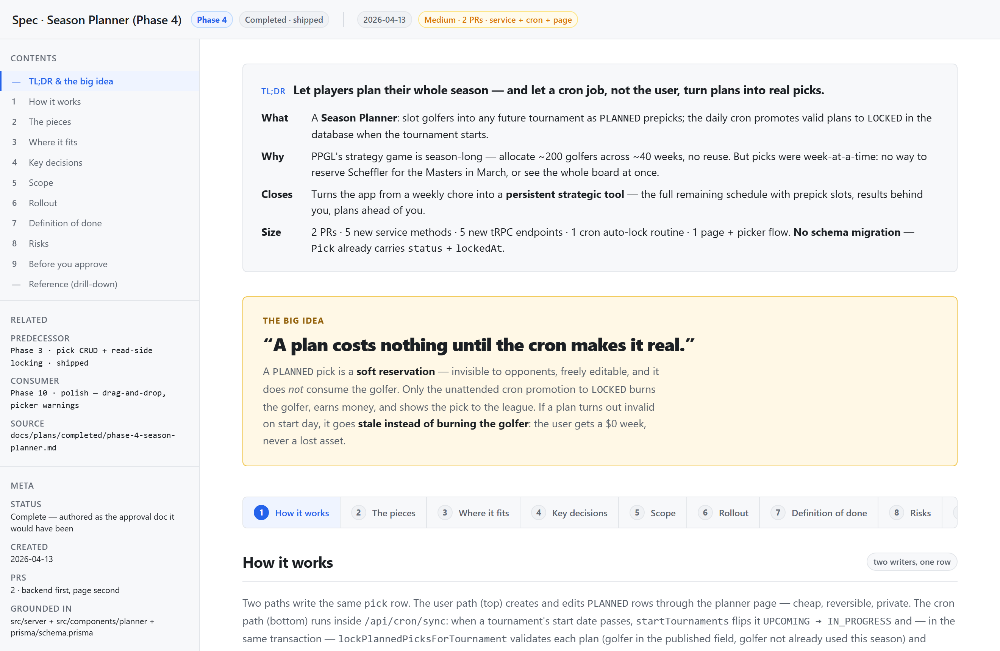
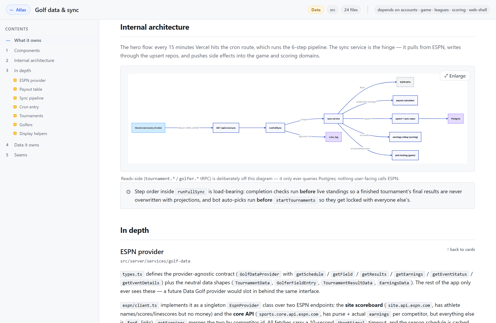

# visual-skills

Turn specs, code changes, and whole codebases into **self-contained, hand-drawn-styled HTML
documents** grounded in your real repo — diagrams, annotated code, file trees, and a guided
narrative, all in one file that opens offline over `file://`.

It ships as **six [Claude Code](https://claude.com/claude-code) skills** over one shared app
shell + diagram pipeline. Most people use it by talking to Claude Code; a direct CLI is available
too ([further down](#direct-cli-usage-without-claude-code)).

| Skill | Ask Claude Code… | Produces |
|---|---|---|
| **visual-atlas** | "make a visual atlas of this codebase" | A standing map of a codebase's domains & architecture |
| **atlas-review** | "review the atlas against the code" | An existing atlas re-verified, updated, and re-stamped |
| **visual-recap** | "make a visual recap of this PR / commit" | A reviewable walkthrough of a code change |
| **visual-spec** | "make this design spec readable so I can approve it" | A design doc / RFC laid out for approval |
| **visual-doc** | "turn this plan into a readable doc" | Any hand-authored markdown as an illustrated doc |
| **quiz** | "quiz me on this PR / spec / doc" | A comprehension check that verifies you understood a change before acting on it |

The first five skills present understanding; **quiz** is their verification counterpart — it
tests it, with reveal-style questions on the page and optional live grading in the terminal.



## What the output looks like

Every page uses the same app shell — a sticky sidebar + scrollspy, a TL;DR fold, progressively
revealed sections, and rendered diagrams. Four example builds live in [`example/`](example/);
**click any screenshot below to open the live demo**, or open the `.html` files locally in a
browser (they need no server).

All examples are real builds from [PPGL](https://ppgl.app), a production fantasy-golf app
(Next.js / tRPC / Postgres, ~150 modules): a feature PR, a bug-fix PR
([pr-190](https://scottyroges.github.io/visual-skills/example/pr-190-season-stats/recap.html)),
a completed phase plan, and the full 8-domain codebase atlas.

<table>
  <tr>
    <td width="50%"><a href="https://scottyroges.github.io/visual-skills/example/pr-194-estimated-purse/recap.html"></a><br><b>visual-recap</b> — a PR as a guided walkthrough</td>
    <td width="50%"><a href="https://scottyroges.github.io/visual-skills/example/spec-season-planner/spec.html"></a><br><b>visual-spec</b> — a design spec for approval</td>
  </tr>
  <tr>
    <td width="50%"><a href="https://scottyroges.github.io/visual-skills/example/atlas-ppgl/atlas.html"></a><br><b>visual-atlas</b> — the system onboarding map</td>
    <td width="50%"><a href="https://scottyroges.github.io/visual-skills/example/atlas-ppgl/domain-golf-data/domain-golf-data.html"></a><br><b>visual-atlas</b> — a per-domain deep-dive page</td>
  </tr>
</table>

## Setup

A one-time, ~5-minute setup gets the skills discoverable from any repo on your machine.

### 1. Clone and install

```sh
git clone https://github.com/scottyroges/visual-skills.git ~/Projects/visual-skills
cd ~/Projects/visual-skills
npm install
```

You can clone anywhere — the skill installer (step 3) records wherever this lives, so nothing is
hard-coded to a fixed path.

### 2. Install `d2` (the diagram rendering floor — required)

Diagrams compile through [`d2`](https://d2lang.com). Without it, diagrams degrade to visible
placeholders (everything else still renders).

```sh
brew install d2          # macOS / Linuxbrew
# or see https://d2lang.com/tour/install for other platforms
```

### 3. Install the skills into Claude Code

```sh
npm run skills:install
```

This **symlinks** the skill dirs into `~/.claude/skills/` and stamps each `SKILL.md`'s
`VISUAL_SKILLS_DIR` to this clone — so the skills work from wherever you cloned the repo, with no
hand-editing of paths. It's idempotent and never clobbers a real dir or a foreign symlink.

> **Note:** the stamp edits the `SKILL.md` files in your clone, so `git status` will show them as
> modified — that's expected; don't commit it. When you pull updates later, reset the stamp first
> and re-apply it:
>
> ```sh
> git checkout -- skills && git pull && npm run skills:install
> ```

Using a non-default Claude config root (a custom location, a sandbox, a per-project `.claude`)?
Point it anywhere with `--dir`:

```sh
npm run skills:install -- --dir /path/to/.claude
```

Confirm Claude Code can see them by asking it to list skills, or check `ls ~/.claude/skills`.

### 4. (Optional) Editable Excalidraw diagrams

By default, flowchart/architecture diagrams render as static D2 sketches. To make them **editable
`.excalidraw` scenes** (open in [excalidraw.com](https://excalidraw.com) or the VS Code Excalidraw
extension), opt in once:

```sh
npm run setup:excalidraw
```

This installs Playwright + Chromium and `@excalidraw/excalidraw` (not saved to `package.json`) and
builds an offline bundle. It's heavy (~hundreds of MB). Even with it installed, the Excalidraw
upgrade is **off by default** — diagrams stay on the static D2 floor unless you opt in with
`--excalidraw` (or `"excalidraw": true` in a spec/atlas JSON). `--no-excalidraw` remains an explicit
off but is now the default.

> **Note — Excalidraw support is in beta and is currently an _export_ only.** At render time each
> diagram produces two artifacts from its source: the **static SVG that's inlined into the HTML**
> (what you see when you open the doc) and a separate **`.excalidraw` sidecar** reachable via the
> "open in Excalidraw" link. The HTML never reads the sidecar, so **editing a `.excalidraw` file does
> not change the rendered document** — the inline SVG is a snapshot, and re-rendering regenerates the
> sidecar from the source (overwriting hand-edits). Treat the `.excalidraw` files as an export for
> reuse elsewhere. To change a diagram *in the doc*, edit its source and re-render.

## Using the skills

Open Claude Code in **any** repo (not this one) and just ask. The skill activates, reads your real
code, and writes a self-contained HTML file under that repo's `.visual/` folder, then offers to open
it.

```text
# In your project, ask Claude Code:
"make a visual atlas of this codebase"
"review the atlas against the code"             (maintenance of an existing atlas)
"make a visual recap of the last commit"        (or: "...of PR 142")
"make this design spec readable so I can approve it"   (point it at a markdown spec)
"turn docs/plan.md into a readable doc"
```

### Try it on the bundled examples

The fastest way to see the *output* is to open the prebuilt examples in [`example/`](example/). To
see the *skills working*, point Claude Code at any spec or git history you have and use the prompts
above — each skill scans the real repo, so the result is specific to your code.

## Keeping an atlas honest (drift check + review)

An atlas is a *standing* document, so staleness is its failure mode. Two mechanisms keep it
truthful — one deterministic, one semantic:

**The drift checker (`atlas-check.mjs`)** — every atlas scan/render copies this self-contained
Node script into the out dir (e.g. `<repo>/.visual/atlas/atlas-check.mjs`). Commit it with the
atlas; it runs with plain Node, so pre-commit hooks and CI never need this repo checked out. It
verifies three layers, all deterministic:

1. **Coverage** — every source module under the config's `srcRoots` is matched by a domain glob
   in `atlas.domains.json`; no recorded module is stale; no domain is empty or missing its page.
2. **Grounding** — the structured claims on each domain page (component/depth `exports[].name`,
   depth `files[].name`, seams `exposes[].api` routes) still exist in that domain's source.
   Catches renamed exports, moved files, and changed routes even when file coverage is unchanged.
3. **Stamps** — each domain page carries `verifiedAgainst: { hash, date, commit }`: a sha256 over
   the domain's module contents (plus the git HEAD, when available) from the last time its prose
   was verified. A mismatch means the code changed since anyone last read the page.

```sh
node .visual/atlas/atlas-check.mjs                 # check — exits 1 on any drift
node .visual/atlas/atlas-check.mjs --stamp         # re-stamp every domain page
node .visual/atlas/atlas-check.mjs --stamp <slug>  # re-stamp specific domains
```

Wire the check into the subject repo's pre-commit (e.g. a package.json script
`"atlas:check": "node .visual/atlas/atlas-check.mjs"` invoked from the hook) or CI.

**The review skill (`atlas-review`)** — the deterministic layers prove *coverage* and
*attention*; only a reader can verify prose. When the stamp check fails, ask Claude Code to
"review the atlas": the skill diffs each stale domain from its stamp's recorded commit, judges
the page block-by-block against the diff, fixes what drifted (minimal edits), re-renders, and
re-stamps exactly what it reviewed. Stamping is always explicit — nothing in the pipeline ever
stamps a page nobody read.

## Direct CLI usage (without Claude Code)

The skills drive these same CLIs; you can run them yourself. `--out` is a per-doc **folder**: the
tool writes `*.html` plus any `.excalidraw` sidecars together inside it (a trailing `.html` is
stripped for convenience). Run from this repo so deps resolve — which means relative paths resolve
against *this* repo's root, so point `--out` at the target repo explicitly.

**Atlas** — a standing map of a codebase's domains & architecture:

```sh
npx tsx bin/atlas.ts --repo /path/to/repo --out /path/to/repo/.visual/atlas   # scan -> draft JSON -> render
# enrich the draft JSON (domain purposes, connections, diagrams), then re-render:
npx tsx bin/atlas.ts --all /path/to/repo/.visual/atlas --out /path/to/repo/.visual/atlas
```

**Recap** — from a git target (commit / branch / PR):

```sh
npx tsx bin/recap.ts --repo /path/to/repo --commit <sha>  --out /path/to/repo/.visual/recaps/x
npx tsx bin/recap.ts --repo /path/to/repo --branch <name> --out /path/to/repo/.visual/recaps/x
npx tsx bin/recap.ts --repo /path/to/repo --pr <number>   --out /path/to/repo/.visual/recaps/x   # needs `gh` CLI
```

Every recap includes a synthesized summary and a "where it fits" dependency graph. To enrich it with
an agent-authored behavioral diagram, emit the gathered blocks as JSON, augment them, and render via
the doc CLI (this is what the `visual-recap` skill does):

```sh
npx tsx bin/recap.ts --repo /path/to/repo --commit <sha> --emit-blocks blocks.json
npx tsx bin/doc.ts --blocks blocks.json --out .visual/recaps/x
```

**Spec** — a design doc / RFC, authored for approval:

```sh
npx tsx bin/spec.ts --blocks spec.json --out .visual/specs/x
```

**Doc** — any hand-authored blocks:

```sh
npx tsx bin/doc.ts --blocks blocks.json --title "My Doc" --out .visual/docs/x
```

Diagrams use the static D2 floor by default. Add `--excalidraw` to any of these to opt into the
editable Excalidraw upgrade (when the toolchain is installed); `--no-excalidraw` is the explicit off.

**Prerequisites:** Node 20+, `d2` on PATH, and `gh` (optional, only for `recap --pr`).

## Scope

Implemented: the D2 floor + assembler + recap gatherer (Prisma+tRPC adapter), Shiki syntax
highlighting + full renderer set, the opt-in editable Excalidraw upgrade with API-surface +
plan-mermaid diagram producers, contextual recaps (synthesized summary + "where it fits" graph +
`--emit-blocks` enrichment), review-narrative recaps (agent-authored summary, per-file diff
descriptions with in-page cross-links, importance-ordered groups), a shared diagram catalog with a
`tabs` multi-view block and widened Excalidraw editability (sequence/class), the `visual-spec`
design-spec→approval skill (its own block model + completeness lint), the `visual-atlas`
codebase-map skill (a mechanical scanner + human-owned `atlas.domains.json` grouping, per-domain
folders, and a demo-standard lint), and the atlas honesty loop (an emitted self-contained drift
checker — coverage/grounding/stamps — plus the `atlas-review` maintenance skill). See
[`docs/superpowers/specs/`](docs/superpowers/specs/).

## License

[MIT](LICENSE)
