# Diagram Catalog Expansion Implementation Plan

> **For agentic workers:** REQUIRED SUB-SKILL: Use superpowers:subagent-driven-development (recommended) or superpowers:executing-plans to implement this plan task-by-task. Steps use checkbox (`- [ ]`) syntax for tracking.

**Goal:** Give the visual-plan / visual-recap skills a curated, tested diagram catalog, widen Excalidraw editability to every natively-supported type, and add a CSS-only multi-view `tabs` block.

**Architecture:** The renderer is already kind-agnostic (every diagram compiles through `d2 --sketch`); `kind` only gates Excalidraw editability. So the bulk of this work is a shared reference doc (`skills/shared/diagrams.md`) plus a standing rot-detector test. The only code changes are the `EXCALIDRAW_EDITABLE` constant and one new `TabsBlock` type rendered by a pure-CSS tab switcher (no view-time JS).

**Tech Stack:** TypeScript (NodeNext ESM, `.js` import specifiers), vitest, the `d2` binary, `@excalidraw/mermaid-to-excalidraw` (opt-in), sanitize-html (unchanged here).

---

## File Structure

- `skills/shared/diagrams.md` — **new.** The diagram catalog: selection guide + per-type recipes. Read by both skills via `$VISUAL_SKILLS_DIR/skills/shared/diagrams.md`.
- `test/diagram-catalog.test.ts` — **new.** Rot-detector: compiles every catalog `d2` block, lints every `mermaid` block.
- `src/render-diagram.ts` — **modify.** Widen `EXCALIDRAW_EDITABLE`; fix stale comments.
- `src/blocks.ts` — **modify.** Add `TabsBlock`; fix stale `mermaid?` comment.
- `src/assemble.ts` — **modify.** Recurse into `tabs` in `assertUniqueIds`/`collectDiagrams`; add `case "tabs"` to `renderBlock`.
- `assets/template.css` — **modify.** `.vs-tabs` pure-CSS switcher styles.
- `test/render-diagram.test.ts`, `test/assemble.test.ts` — **modify.** New assertions.
- `skills/visual-recap/SKILL.md`, `skills/visual-plan/SKILL.md` — **modify.** Point at catalog; multi-diagram `tabs` guidance.
- `test/skill-docs.test.ts` — **modify.** `tabs` coverage; catalog-reference + new-guidance assertions.
- `README.md` — **modify.** Scope line.

---

## Task 1: Diagram catalog + rot-detector test

**Files:**
- Create: `skills/shared/diagrams.md`
- Create: `test/diagram-catalog.test.ts`

The test is the oracle: it compiles every `d2` recipe in the catalog. If a recipe in the
content below fails to compile in your `d2` version, **fix the recipe** until it renders — do
not weaken the test. That round-trip is the entire point of this task.

**Catalog format contract** (the test depends on it):
- Entries live after a literal `<!-- catalog-entries-start -->` marker line.
- Each entry is a `### ` heading.
- Each entry has a metadata line matching `**editable:** yes` or `**editable:** no`.
- Each entry has ≥1 fenced ` ```d2 ` block. Entries marked `editable: yes` also have ≥1
  fenced ` ```mermaid ` block.

- [ ] **Step 1: Write the failing test**

Create `test/diagram-catalog.test.ts`:

```ts
import { describe, it, expect } from "vitest";
import { readFileSync } from "node:fs";
import { renderDiagram } from "../src/render-diagram.js";
import type { DiagramBlock } from "../src/blocks.js";

const catalog = readFileSync(new URL("../skills/shared/diagrams.md", import.meta.url), "utf8");

const fences = (src: string, lang: string): string[] =>
  [...src.matchAll(new RegExp("```" + lang + "\\n([\\s\\S]*?)```", "g"))].map((m) => m[1].trim());

// Mermaid headers that convert to EDITABLE excalidraw elements. stateDiagram/erDiagram
// rasterize, so they're forbidden in the catalog (author states as a flowchart instead).
const ALLOWED_MERMAID = /^(graph|flowchart|sequenceDiagram|classDiagram)\b/;

describe("diagram catalog", () => {
  it("has entries and the parse marker", () => {
    expect(catalog).toContain("<!-- catalog-entries-start -->");
  });

  it("compiles every d2 recipe to an svg (no placeholder)", async () => {
    const recipes = fences(catalog, "d2");
    expect(recipes.length).toBeGreaterThanOrEqual(10);
    for (const d2 of recipes) {
      const block: DiagramBlock = { type: "diagram", id: "t", title: "t", kind: "flowchart", d2 };
      const out = await renderDiagram(block, { excalidraw: false });
      expect(out.svg, `recipe failed to compile:\n${d2}`).toMatch(/<svg/);
      expect(out.svg.toLowerCase(), `recipe degraded to placeholder:\n${d2}`).not.toContain("failed to render");
    }
  }, 120_000);

  it("every mermaid recipe uses an editable-supported header", () => {
    const recipes = fences(catalog, "mermaid");
    expect(recipes.length).toBeGreaterThanOrEqual(5);
    for (const m of recipes) {
      expect(m, `mermaid must start with an editable header:\n${m}`).toMatch(ALLOWED_MERMAID);
      expect(m, `stateDiagram/erDiagram rasterize — author as flowchart:\n${m}`).not.toMatch(/^(stateDiagram|erDiagram)/);
    }
  });

  it("every editable:yes entry pairs d2 with mermaid", () => {
    const body = catalog.slice(catalog.indexOf("<!-- catalog-entries-start -->"));
    const entries = body.split(/\n### /).slice(1); // drop preamble before first entry
    expect(entries.length).toBeGreaterThanOrEqual(10);
    for (const entry of entries) {
      const name = entry.split("\n")[0].trim();
      const editable = /\*\*editable:\*\*\s*yes/.test(entry);
      expect(fences(entry, "d2").length, `entry "${name}" needs a d2 recipe`).toBeGreaterThanOrEqual(1);
      if (editable) {
        expect(fences(entry, "mermaid").length, `editable entry "${name}" needs a mermaid recipe`).toBeGreaterThanOrEqual(1);
      }
    }
  });
});
```

- [ ] **Step 2: Run the test to verify it fails**

Run: `npm test -- diagram-catalog`
Expected: FAIL — `ENOENT` / cannot read `skills/shared/diagrams.md` (file does not exist yet).

- [ ] **Step 3: Create the catalog**

Create `skills/shared/diagrams.md` with exactly this content:

````markdown
# Diagram Catalog

Shared selection guide + tested recipes for the `visual-plan` and `visual-recap` skills. Every
recipe's `d2` is the dependable render floor; entries marked **editable: yes** also carry a
`mermaid` source so the optional Excalidraw upgrade produces an editable scene.

Pick the **fewest** diagrams that explain the change. One strong diagram beats three weak ones.
When 2–3 different lenses each add distinct value, present them in a `tabs` block rather than
forcing one. Ground every node label in real identifiers from the target repo.

## Selection guide

**Structure — what exists**
- *Dependency graph* — modules as nodes, imports as arrows; surfaces coupling and cycles. (This
  is also produced mechanically as the recap's `where-it-fits` diagram.)
- *Deployment / infra* — what runs where (ALB, ECS, RDS, Redis…).

**Behavior — what happens at runtime**
- *Sequence* — collaborators on lifelines, time downward; ONE scenario, multi-collaborator path.
- *State machine* — an entity in one of N bounded states with labeled transitions.

**Boundaries — what is separated**
- *Bounded-context map (DDD)* — domain boundaries and the contracts at their seams.
- *API surface* — what a service exposes / consumes. (Also a mechanical recap producer.)

**Data flow — how information moves**
- *Data-flow* — sources → transformations → sinks. (ETL/pipeline is the same shape staged.)
- *Event / pub-sub topology* — publishers, topics, subscribers.

**Operations — how things fail and recover**
- *CI / build pipeline* — commit → deploy stages.
- *Blast-radius / failure-mode* — what falls over if X dies.

**C4 ladder — zoom levels** (context → container → component). The *code* level (class diagram
for one component) is rarely worth drawing — use the `class` kind directly if ever needed.

**Journey — branching work**
- *Decomposition* — happy path as one flow, each major edge case branching off. Most-used.
- *Swimlane / activity* — lanes by actor (customer / frontend / backend / external).

**Tie-breakers**
- Branching driven by handoffs between actors → **swimlane**.
- Branching driven by an entity's bounded state → **state machine**.
- Genuinely tree-shaped with no rejoining paths → a state-machine/decomposition variant.

**Out of scope** (stakeholder/discovery formats, not engineering deliverables — do not attempt):
journey maps (UX phases/emotions), BPMN gateway notation, event storming sticky-notes.

## Authoring notes

- `d2` is required and is the floor. Quote any d2 key/value containing a dot or space.
- Only `flowchart`/`graph`, `sequenceDiagram`, and `classDiagram` mermaid convert to *editable*
  Excalidraw elements. `stateDiagram` and `erDiagram` rasterize — so author a **state machine as
  a mermaid `flowchart`** (states as nodes, transitions as labeled edges), never `stateDiagram`.
- An invalid diagram degrades to a visible placeholder rather than breaking the document.

<!-- catalog-entries-start -->

### Dependency graph
- **kind:** `architecture` — **editable:** yes
- **Use when:** showing how the changed module sits among its importers/imports; spotting cycles.
- **Avoid when:** the relationship is a runtime call sequence (use Sequence instead).
- Module-boundary diagrams (internal package/namespace seams) are the same shape at a finer grain.

```d2
direction: right
billing -> user
billing -> auth
auth -> user
```

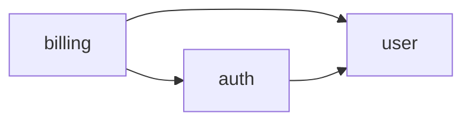

### Deployment / infra
- **kind:** `architecture` — **editable:** yes
- **Use when:** the change touches what runs where (a new queue, cache, managed service).
- **Avoid when:** nothing about the topology changed.

```d2
"ALB" -> "ECS service": HTTPS
"ECS service" -> "RDS (Postgres)": SQL
"ECS service" -> "Redis": cache
```

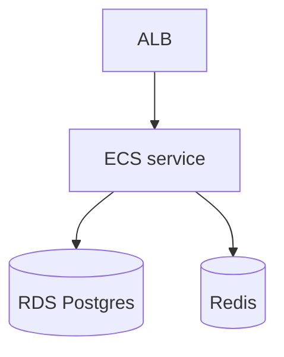

### Sequence
- **kind:** `sequence` — **editable:** yes
- **Use when:** the change adds/alters a multi-collaborator runtime path (request flow, integration call chain).
- **Avoid when:** there is only one actor, or order doesn't matter.

```d2
shape: sequence_diagram
client -> api: captureOrder(id)
api -> paypal: capture(id)
paypal -> api: ok
api -> client: order
```

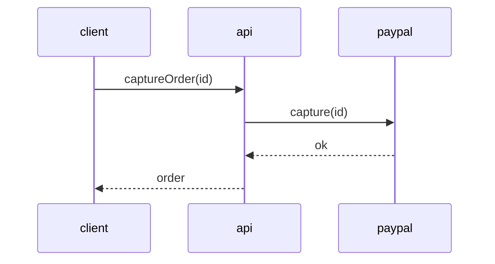

### State machine
- **kind:** `flowchart` — **editable:** yes
- **Use when:** an entity moves through bounded states (subscription, checkout, signup).
- **Avoid when:** there are no real states, just a linear flow.
- Authored as a `flowchart` (NOT `stateDiagram`) so it stays editable.

```d2
direction: right
PENDING -> PAID: capture
PENDING -> CANCELLED: cancel
PAID -> REFUNDED: refund
```

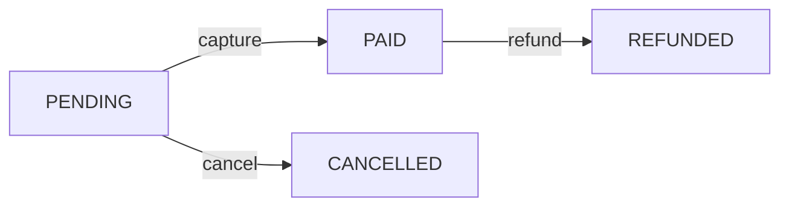

### Bounded-context map
- **kind:** `architecture` — **editable:** yes
- **Use when:** showing domain boundaries and the contracts (ACL, shared kernel) at their seams.
- **Avoid when:** the system is a single context.

```d2
"Billing" -> "Identity": "customer id (ACL)"
"Catalog" -> "Billing": "price (shared kernel)"
```

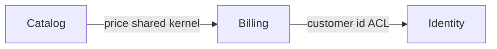

### API surface
- **kind:** `architecture` — **editable:** yes
- **Use when:** showing what a service/router exposes and who consumes it.
- **Avoid when:** the recap's mechanical api-surface diagram already covers it.

```d2
"web app" -> "league router"
"league router": {
  list
  create
}
```

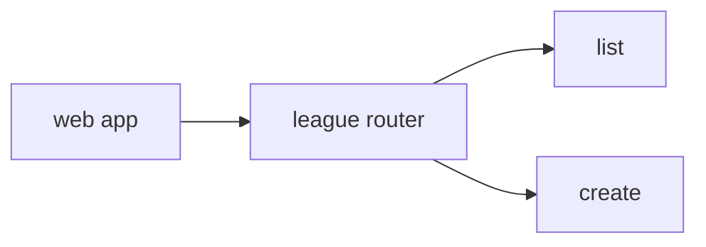

### Data-flow
- **kind:** `architecture` — **editable:** yes
- **Use when:** tracing how data is sourced, transformed, and stored. ETL/streaming pipelines are
  the same shape with explicit stages.
- **Avoid when:** there is no transformation, just a single read/write.

```d2
"CSV upload" -> "validator" -> "normalizer" -> "Postgres"
"normalizer" -> "metrics sink"
```

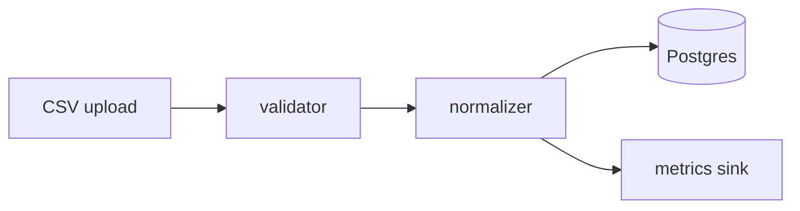

### Event / pub-sub topology
- **kind:** `architecture` — **editable:** yes
- **Use when:** the change adds a publisher, topic, or subscriber.
- **Avoid when:** the call is synchronous (use Sequence).

```d2
"OrderService" -> "orders.created": publish
"orders.created" -> "EmailWorker": subscribe
"orders.created" -> "AnalyticsWorker": subscribe
```

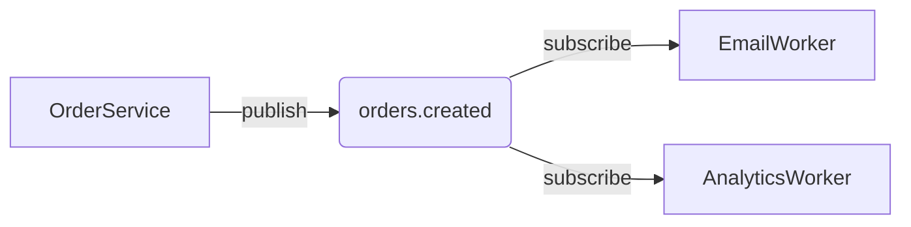

### CI / build pipeline
- **kind:** `flowchart` — **editable:** yes
- **Use when:** the change alters how code goes from commit to deploy.
- **Avoid when:** CI is unchanged.

```d2
direction: right
commit -> build -> test -> "deploy staging" -> "deploy prod"
```

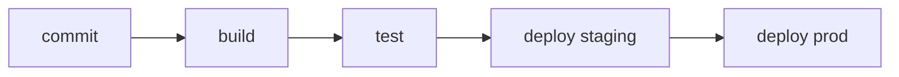

### Blast-radius / failure-mode
- **kind:** `architecture` — **editable:** yes
- **Use when:** explaining what fails downstream if a dependency dies.
- **Avoid when:** the change has no new failure dependency.

```d2
"Redis down" -> "session reads fail"
"Redis down" -> "rate limiter fails open"
"session reads fail" -> "users logged out"
```

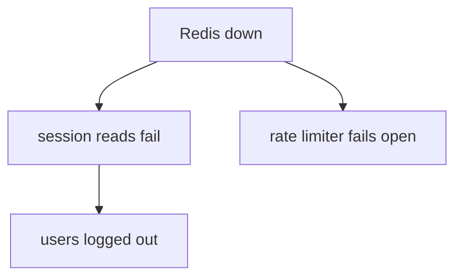

### C4 context
- **kind:** `architecture` — **editable:** yes
- **Use when:** the highest zoom — the system as one box plus its users and external systems.

```d2
"Customer" -> "PPGL system": uses
"PPGL system" -> "PayPal": payments
"PPGL system" -> "Email provider": mail
```

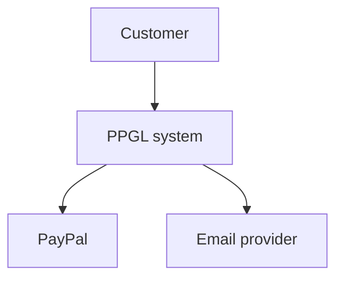

### C4 container
- **kind:** `architecture` — **editable:** yes
- **Use when:** the separately-deployable things inside the system (web app, API, DB, worker).

```d2
"Web app (Next.js)" -> "API (tRPC)": "JSON/HTTPS"
"API (tRPC)" -> "Postgres": Prisma
"API (tRPC)" -> "Worker": queue
```

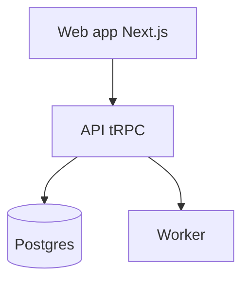

### C4 component
- **kind:** `architecture` — **editable:** yes
- **Use when:** the major internal pieces of one container (controllers, services, repositories).

```d2
"league router" -> "LeagueService"
"LeagueService" -> "LeagueRepository"
"LeagueService" -> "PayPalClient"
```

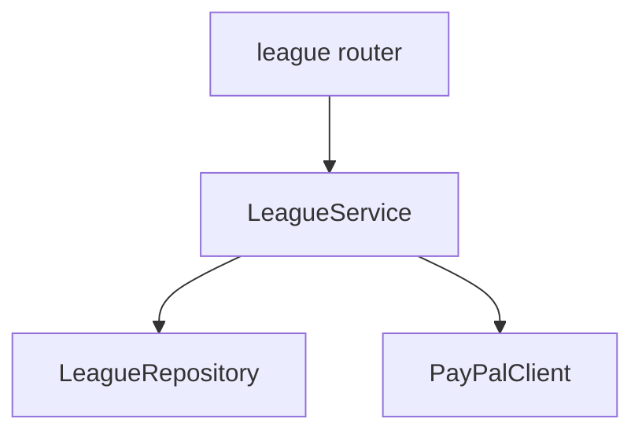

### Decomposition
- **kind:** `flowchart` — **editable:** yes
- **Use when:** a journey with a happy path plus a few named edge cases.
- **Avoid when:** the branching is state-driven (use State machine) or actor-driven (use Swimlane).

```d2
direction: right
start -> validate -> charge -> confirm
validate -> "reject: invalid"
charge -> "retry: gateway error"
```

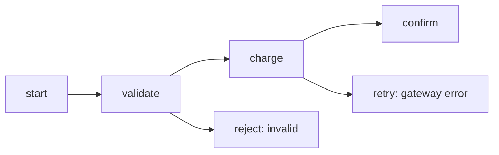

### Swimlane / activity
- **kind:** `flowchart` — **editable:** yes
- **Use when:** branching is driven by handoffs between actors.
- **Avoid when:** there's a single actor.

```d2
Customer.pay -> Frontend.submit
Frontend.submit -> Backend.capture
Backend.capture -> External.paypal
```

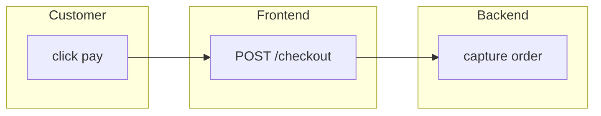

### ERD / schema
- **kind:** `erd` — **editable:** no
- **Use when:** showing entities and relations. (The recap produces this mechanically from a
  Prisma diff.) Stays static — ER mermaid rasterizes in Excalidraw, so no mermaid here.

```d2
User: {
  shape: sql_table
  id: int
  email: string
}
Order: {
  shape: sql_table
  id: int
  user_id: int
}
Order.user_id -> User.id
```
````

- [ ] **Step 4: Run the test to verify it passes**

Run: `npm test -- diagram-catalog`
Expected: PASS (4 tests). If any `d2` recipe degrades to a placeholder, fix that recipe's d2
syntax until it renders, then re-run. Do not edit the test thresholds.

- [ ] **Step 5: Commit**

```bash
git add skills/shared/diagrams.md test/diagram-catalog.test.ts
git commit -m "feat: shared diagram catalog with d2-compile rot detector

Co-Authored-By: Claude Opus 4.8 (1M context) <noreply@anthropic.com>"
```

---

## Task 2: Widen Excalidraw editability

**Files:**
- Modify: `src/render-diagram.ts:55-57` (the `EXCALIDRAW_EDITABLE` set + comment) and `:13-15` (stale routing comment)
- Modify: `src/blocks.ts:9` (stale `mermaid?` comment)
- Test: `test/render-diagram.test.ts`

- [ ] **Step 1: Write the failing test**

Append these tests inside the existing `describe("renderDiagram (D2 floor)", ...)` block in
`test/render-diagram.test.ts` (after the last `it(...)`, before the closing `});`):

```ts
  it("routes an eligible sequence block (with mermaid) to the excalidraw upgrade", async () => {
    const block: DiagramBlock = {
      type: "diagram", id: "seq", title: "Seq", kind: "sequence",
      d2: "shape: sequence_diagram\na -> b: hi",
      mermaid: "sequenceDiagram\n  a->>b: hi",
    };
    let converted = false;
    const out = await renderDiagram(
      block,
      {},
      { ready: async () => true, convert: async () => { converted = true; return { svg: "<svg id='x'/>", scene: {} }; } },
    );
    expect(converted).toBe(true);
    expect(out.renderer).toBe("excalidraw");
  }, 30_000);

  it("routes an eligible class block (with mermaid) to the excalidraw upgrade", async () => {
    const block: DiagramBlock = {
      type: "diagram", id: "cls", title: "Cls", kind: "class",
      d2: "A -> B",
      mermaid: "classDiagram\n  A <|-- B",
    };
    let converted = false;
    const out = await renderDiagram(
      block,
      {},
      { ready: async () => true, convert: async () => { converted = true; return { svg: "<svg id='x'/>", scene: {} }; } },
    );
    expect(converted).toBe(true);
    expect(out.renderer).toBe("excalidraw");
  }, 30_000);
```

- [ ] **Step 2: Run the test to verify it fails**

Run: `npm test -- render-diagram`
Expected: FAIL — both new tests fail (`converted` is `false`, `renderer` is `"d2"`) because
`sequence` and `class` are not yet in `EXCALIDRAW_EDITABLE`.

- [ ] **Step 3: Widen the editable set and fix stale comments**

In `src/render-diagram.ts`, replace lines 55-57:

```ts
// Kinds mermaid-to-excalidraw turns into native editable elements. Conservative
// on purpose — anything not here goes to D2. (Dormant this slice.)
const EXCALIDRAW_EDITABLE = new Set<string>(["flowchart", "architecture"]);
```

with:

```ts
// Kinds mermaid-to-excalidraw converts to native EDITABLE elements: flowchart, sequence,
// class (and our "architecture", authored as a mermaid flowchart). Everything else (erd,
// and any stateDiagram-authored mermaid) rasterizes to a non-editable image, so it stays
// on the D2 floor. State machines are authored as flowcharts precisely to remain editable.
const EXCALIDRAW_EDITABLE = new Set<string>(["flowchart", "architecture", "sequence", "class"]);
```

Then replace the routing comment at lines 13-15:

```ts
// Routing is by diagram KIND, not by "is the toolchain available" — because
// mermaid-to-excalidraw silently rasterizes ERDs/sequence diagrams instead of
// failing, which is worse than D2's native sketch. So only the kinds it
// converts to native editable elements are eligible for the upgrade.
```

with:

```ts
// Routing is by diagram KIND, not by "is the toolchain available" — because
// mermaid-to-excalidraw silently rasterizes unsupported types (ERD, stateDiagram)
// into a non-editable image instead of failing, which is worse than D2's native
// sketch. So only the kinds it converts to native editable elements (flowchart,
// architecture, sequence, class) are eligible for the upgrade.
```

- [ ] **Step 4: Fix the stale comment in blocks.ts**

In `src/blocks.ts`, replace line 9:

```ts
  mermaid?: string;      // OPTIONAL — only for editable-eligible kinds (flowchart/architecture)
```

with:

```ts
  mermaid?: string;      // OPTIONAL — only for editable-eligible kinds (flowchart/architecture/sequence/class)
```

- [ ] **Step 5: Run the tests to verify they pass**

Run: `npm test -- render-diagram` then `npm run typecheck`
Expected: PASS (all render-diagram tests, including the two new ones); typecheck clean.

- [ ] **Step 6: Commit**

```bash
git add src/render-diagram.ts src/blocks.ts test/render-diagram.test.ts
git commit -m "feat: excalidraw-editable now includes sequence and class kinds

Co-Authored-By: Claude Opus 4.8 (1M context) <noreply@anthropic.com>"
```

---

## Task 3: `TabsBlock` — pure-CSS multi-view container

**Files:**
- Modify: `src/blocks.ts` (add `TabsBlock`, extend `Block` union)
- Modify: `src/assemble.ts` (recurse in `assertUniqueIds`/`collectDiagrams`; add `case "tabs"`)
- Modify: `assets/template.css` (append `.vs-tabs` styles)
- Test: `test/assemble.test.ts`

- [ ] **Step 1: Write the failing test**

Append this `describe` block at the end of `test/assemble.test.ts` (before EOF):

```ts
describe("assemble — tabs block", () => {
  it("renders multiple panels with exactly one visible by default", async () => {
    const blocks: Block[] = [
      { type: "tabs", id: "views", title: "Two views", tabs: [
        { label: "Flow", block: { type: "diagram", id: "d-flow", title: "Flow", kind: "flowchart", d2: "a -> b" } },
        { label: "Seq", block: { type: "diagram", id: "d-seq", title: "Seq", kind: "sequence", d2: "shape: sequence_diagram\na -> b: hi" } },
      ] },
    ];
    const html = await assemble(blocks, { title: "T", source: "s" });
    expect(html).toContain('class="vs-block vs-tabs"');
    expect(html).toContain('id="views"');                 // container anchor
    expect(html).toContain('name="vs-tabs-views"');        // radio group
    expect(html).toContain("checked");                     // first tab pre-selected
    expect(html).toContain(">Flow<");
    expect(html).toContain(">Seq<");
    // both diagrams rendered into panels
    expect((html.match(/<svg/g) ?? []).length).toBeGreaterThanOrEqual(2);
    // exactly one radio is checked by default
    expect((html.match(/ checked/g) ?? []).length).toBe(1);
    expect(html).not.toContain("<script");
  });

  it("collects a diagram nested inside a tab for the up-front render pass", async () => {
    const blocks: Block[] = [
      { type: "tabs", id: "v", tabs: [
        { label: "A", block: { type: "diagram", id: "nested", title: "Nested", kind: "flowchart", d2: "a -> b" } },
      ] },
    ];
    const html = await assemble(blocks, { title: "T", source: "s" });
    expect(html).toContain('id="nested"');   // got an anchor => was rendered, not skipped
    expect(html).toContain("<svg");
  });

  it("throws on a duplicate id nested inside a tab", async () => {
    const blocks: Block[] = [
      { type: "prose", id: "dup", markdown: "x" },
      { type: "tabs", id: "v", tabs: [
        { label: "A", block: { type: "prose", id: "dup", markdown: "y" } },
      ] },
    ];
    await expect(assemble(blocks, { title: "T", source: "s" })).rejects.toThrow(/duplicate block id "dup"/);
  });

  it("throws when a tab contains a group or tabs (one level deep)", async () => {
    const blocks: Block[] = [
      { type: "tabs", id: "v", tabs: [
        { label: "A", block: { type: "group", id: "g", title: "G", blocks: [] } },
      ] },
    ];
    await expect(assemble(blocks, { title: "T", source: "s" })).rejects.toThrow(/may not contain a group or tabs/);
  });
});
```

- [ ] **Step 2: Run the test to verify it fails**

Run: `npm test -- assemble`
Expected: FAIL — TypeScript/runtime errors because `type: "tabs"` is not a known `Block`.

- [ ] **Step 3: Add the `TabsBlock` type**

In `src/blocks.ts`, add this interface immediately after the `GroupBlock` interface (after line 92):

```ts
export interface TabsBlock {
  type: "tabs";
  id: string;
  title?: string;
  // One level deep — each tab holds a single non-container block (typically a diagram).
  tabs: { label: string; block: Block }[];
}
```

Then extend the `Block` union — change:

```ts
export type Block =
  | DiagramBlock
  | SchemaBlock
  | ApiBlock
  | FileTreeBlock
  | DiffBlock
  | ProseBlock
  | AnnotatedCodeBlock
  | QuestionsBlock
  | GroupBlock;
```

to add `| TabsBlock`:

```ts
export type Block =
  | DiagramBlock
  | SchemaBlock
  | ApiBlock
  | FileTreeBlock
  | DiffBlock
  | ProseBlock
  | AnnotatedCodeBlock
  | QuestionsBlock
  | GroupBlock
  | TabsBlock;
```

- [ ] **Step 4: Recurse into tabs in assemble's guards**

In `src/assemble.ts`, update `assertUniqueIds` (currently lines 30-38) — change the recursion line:

```ts
    if (b.type === "group") assertUniqueIds(b.blocks, seen);
```

to also handle tabs:

```ts
    if (b.type === "group") assertUniqueIds(b.blocks, seen);
    else if (b.type === "tabs") assertUniqueIds(b.tabs.map((t) => t.block), seen);
```

Then update `collectDiagrams` (currently lines 43-50) — change:

```ts
      if (isDiagramBlock(b)) out.push(b);
      else if (b.type === "group") out.push(...collectDiagrams(b.blocks));
```

to:

```ts
      if (isDiagramBlock(b)) out.push(b);
      else if (b.type === "group") out.push(...collectDiagrams(b.blocks));
      else if (b.type === "tabs") out.push(...collectDiagrams(b.tabs.map((t) => t.block)));
```

- [ ] **Step 5: Add the `case "tabs"` renderer**

In `src/assemble.ts`, inside `renderBlock`'s `switch`, add this case immediately after the
`case "group": { ... }` block (after line 94, before the `default:`):

```ts
      case "tabs": {
        for (const t of b.tabs) {
          if (t.block.type === "group" || t.block.type === "tabs") {
            throw new Error(`tab in "${b.id}" may not contain a group or tabs — one level deep only`);
          }
        }
        const heading = b.title ? `<h2>${escapeHtml(b.title)}</h2>` : "";
        const name = `vs-tabs-${b.id}`;
        const radios = b.tabs
          .map((_, i) => `<input type="radio" class="vs-tabradio" name="${escapeHtml(name)}" id="${escapeHtml(b.id)}--${i}"${i === 0 ? " checked" : ""}>`)
          .join("");
        const labels = b.tabs
          .map((t, i) => `<label for="${escapeHtml(b.id)}--${i}">${escapeHtml(t.label)}</label>`)
          .join("");
        const panelsHtml = await Promise.all(b.tabs.map((t) => renderBlock(t.block)));
        const panels = panelsHtml.map((p) => `<div class="vs-tabpanel">${p}</div>`).join("");
        html =
          `<section class="vs-block vs-tabs">${heading}` +
          `<div class="vs-tabset">${radios}<div class="vs-tablabels">${labels}</div>` +
          `<div class="vs-tabpanels">${panels}</div></div></section>`;
        break;
      }
```

(The `default:` exhaustiveness check now sees `tabs` handled, so the `never` assignment stays valid.)

- [ ] **Step 6: Add the pure-CSS tab styles**

Append to `assets/template.css`:

```css
/* ── tabs (pure CSS, no view-time JS) ─────────────────────────────────────── */
.vs-tabs .vs-tabradio { position: absolute; width: 1px; height: 1px; opacity: 0; pointer-events: none; }
.vs-tabs .vs-tablabels { display: flex; flex-wrap: wrap; gap: 4px; border-bottom: 2px solid #d6d3cd; margin-bottom: 12px; }
.vs-tabs .vs-tablabels label { cursor: pointer; padding: 6px 14px; border: 1px solid #d6d3cd; border-bottom: none;
  border-radius: 8px 8px 0 0; background: #f4f2ee; font-weight: 600; margin-bottom: -2px; }
.vs-tabs .vs-tabpanel { display: none; }
/* Reveal the nth panel / highlight the nth label when the nth radio is checked (supports up to 6 tabs). */
.vs-tabs .vs-tabradio:nth-of-type(1):checked ~ .vs-tabpanels > .vs-tabpanel:nth-child(1),
.vs-tabs .vs-tabradio:nth-of-type(2):checked ~ .vs-tabpanels > .vs-tabpanel:nth-child(2),
.vs-tabs .vs-tabradio:nth-of-type(3):checked ~ .vs-tabpanels > .vs-tabpanel:nth-child(3),
.vs-tabs .vs-tabradio:nth-of-type(4):checked ~ .vs-tabpanels > .vs-tabpanel:nth-child(4),
.vs-tabs .vs-tabradio:nth-of-type(5):checked ~ .vs-tabpanels > .vs-tabpanel:nth-child(5),
.vs-tabs .vs-tabradio:nth-of-type(6):checked ~ .vs-tabpanels > .vs-tabpanel:nth-child(6) { display: block; }
.vs-tabs .vs-tabradio:nth-of-type(1):checked ~ .vs-tablabels label:nth-child(1),
.vs-tabs .vs-tabradio:nth-of-type(2):checked ~ .vs-tablabels label:nth-child(2),
.vs-tabs .vs-tabradio:nth-of-type(3):checked ~ .vs-tablabels label:nth-child(3),
.vs-tabs .vs-tabradio:nth-of-type(4):checked ~ .vs-tablabels label:nth-child(4),
.vs-tabs .vs-tabradio:nth-of-type(5):checked ~ .vs-tablabels label:nth-child(5),
.vs-tabs .vs-tabradio:nth-of-type(6):checked ~ .vs-tablabels label:nth-child(6) { background: #fff; border-bottom: 2px solid #fff; }
@media print { .vs-tabs .vs-tabpanel { display: block !important; } }
```

- [ ] **Step 7: Run the tests to verify they pass**

Run: `npm test -- assemble` then `npm run typecheck`
Expected: PASS (all assemble tests, including the four new tabs tests); typecheck clean.

- [ ] **Step 8: Commit**

```bash
git add src/blocks.ts src/assemble.ts assets/template.css test/assemble.test.ts
git commit -m "feat: TabsBlock — pure-CSS multi-view diagram switcher

Co-Authored-By: Claude Opus 4.8 (1M context) <noreply@anthropic.com>"
```

---

## Task 4: Skill wiring + docs

**Files:**
- Modify: `skills/visual-recap/SKILL.md` (catalog pointer; multi-diagram `tabs` guidance)
- Modify: `skills/visual-plan/SKILL.md` (catalog pointer; `tabs` in block mapping)
- Modify: `test/skill-docs.test.ts` (tabs coverage; catalog-reference + new-guidance assertions)
- Modify: `README.md` (Scope line)

- [ ] **Step 1: Write the failing test**

In `test/skill-docs.test.ts`, replace the test `it("visual-recap documents the behavioral diagram selection guide", ...)` with:

```ts
  it("both skills reference the shared diagram catalog", () => {
    for (const md of [planSkill, recapSkill]) {
      expect(md).toContain("skills/shared/diagrams.md");
    }
  });

  it("visual-recap documents catalog-driven, possibly-multiple diagrams via tabs", () => {
    expect(recapSkill).toContain("--emit-blocks");
    expect(recapSkill).toContain("catalog");
    expect(recapSkill).toContain("tabs");
  });
```

(Leave the other existing tests — frontmatter, review-narrative enrichment, block-type coverage — unchanged. The block-type coverage test already iterates every `type:` literal, so it will now also require `` `tabs` `` to appear in visual-plan.)

- [ ] **Step 2: Run the test to verify it fails**

Run: `npm test -- skill-docs`
Expected: FAIL — the catalog-reference test fails (skills don't mention the catalog yet) and the
block-coverage test fails (visual-plan doesn't mention `` `tabs` `` yet).

- [ ] **Step 3: Wire visual-recap to the catalog + tabs**

First, reconcile the retained "Add context" step 6 so it no longer hard-codes "ONE". In
`skills/visual-recap/SKILL.md`, replace:

```markdown
6. **Author ONE behavioral diagram** for the change (see the selection guide) and place it
   near the top (after the Summary / where-it-fits).
```

with:

```markdown
6. **Author the diagram(s)** for the change — see "Which diagram(s) to add" below. Prefer one;
   use a `tabs` block when 2–3 lenses each add value. Place them near the top (after the Summary
   / where-it-fits).
```

Then, replace the entire section starting at
`### Which behavioral diagram to pick` through the end of the
`### Authoring recipes (valid d2)` section (i.e. from `### Which behavioral diagram to pick` to
end of file) with:

```markdown
### Which diagram(s) to add

Consult the shared **diagram catalog** for the full selection guide and tested recipes:

    $VISUAL_SKILLS_DIR/skills/shared/diagrams.md

Prefer the fewest diagrams that explain the change — often ONE. The catalog's *Behavior* and
*Journey* lenses cover most recaps (a sequence for a new runtime path; a state machine for a
lifecycle change). When 2–3 lenses each add distinct value (e.g. a sequence AND a state machine,
or the `where-it-fits` graph AND a data-flow), present them in a `tabs` block instead of forcing
one. If the change is purely structural, the mechanical `where-it-fits` graph may already be
enough — skip adding more.

Use the catalog's recipes verbatim (they are compile-tested), substituting real identifiers.

### Grouping multiple diagrams into tabs

A `tabs` block presents complementary views as a CSS-only switcher (no JS):

    { "type": "tabs", "id": "views", "title": "How it works", "tabs": [
      { "label": "Sequence",  "block": { "type": "diagram", "id": "seq", "title": "captureOrder flow", "kind": "sequence",
        "d2": "shape: sequence_diagram\nclient -> api: captureOrder(id)\napi -> paypal: capture(id)" } },
      { "label": "States",    "block": { "type": "diagram", "id": "states", "title": "Order states", "kind": "flowchart",
        "d2": "direction: right\nPENDING -> PAID: capture\nPENDING -> CANCELLED: cancel" } }
    ] }

Each tab holds ONE block (one level deep — a tab may not contain a `group` or another `tabs`).
Place the tabs near the top, after the Summary and the `where-it-fits` diagram.
```

- [ ] **Step 4: Wire visual-plan to the catalog + tabs**

In `skills/visual-plan/SKILL.md`, find the `- **grouping -> \`group\`**` bullet (around line 70)
and add this bullet immediately after it:

```markdown
- **multiple views of one thing -> `tabs`** — a CSS-only tab switcher (no JS) presenting
  complementary diagrams as switchable panels. Each tab holds ONE block, one level deep (a tab
  may not contain a `group` or another `tabs`).

      { "type": "tabs", "id": "views", "title": "Two views", "tabs": [
        { "label": "Flow", "block": { "type": "diagram", "id": "v-flow", "title": "Flow", "kind": "flowchart", "d2": "a -> b" } },
        { "label": "Seq",  "block": { "type": "diagram", "id": "v-seq", "title": "Seq", "kind": "sequence", "d2": "shape: sequence_diagram\na -> b: hi" } } ] }
```

Then, in the same file, find the `## Content -> block mapping` heading and add this line
immediately under it (before the `Primary blocks...` line):

```markdown
For diagram selection (which structural / boundary / data-flow / behavioral diagram to use) and
compile-tested recipes, consult the shared catalog: `$VISUAL_SKILLS_DIR/skills/shared/diagrams.md`.
```

- [ ] **Step 5: Run the test to verify it passes**

Run: `npm test -- skill-docs`
Expected: PASS — catalog-reference, new-guidance, and block-coverage (now incl. `tabs`) all pass.

- [ ] **Step 6: Update the README scope line**

In `README.md`, in the `## Scope` section, replace the final sentence:

```markdown
and review-narrative recaps — agent-authored "Summary",
per-file diff descriptions with in-page cross-links, and importance-ordered `group`s
(M7). Deprioritized: `gh pr comment` integration (M5). See `docs/superpowers/specs/`.
```

with:

```markdown
and review-narrative recaps — agent-authored "Summary",
per-file diff descriptions with in-page cross-links, and importance-ordered `group`s
(M7), and a shared diagram catalog with a `tabs` multi-view block plus widened
Excalidraw editability (sequence/class) (M8). Deprioritized: `gh pr comment`
integration (M5). See `docs/superpowers/specs/`.
```

- [ ] **Step 7: Run the full suite + typecheck**

Run: `npm test` then `npm run typecheck`
Expected: PASS (all test files green); typecheck clean.

- [ ] **Step 8: Commit**

```bash
git add skills/visual-recap/SKILL.md skills/visual-plan/SKILL.md test/skill-docs.test.ts README.md
git commit -m "docs: wire skills to the diagram catalog + tabs guidance

Co-Authored-By: Claude Opus 4.8 (1M context) <noreply@anthropic.com>"
```

---

## Final verification (after all tasks)

- [ ] `npm test` — all green (incl. `diagram-catalog`, new `assemble`/`render-diagram`/`skill-docs` cases).
- [ ] `npm run typecheck` — clean.
- [ ] Manual smoke: author a `blocks.json` with a `tabs` block holding two diagrams, run
  `npx tsx bin/plan.ts --blocks blocks.json --out /tmp/tabs-demo`, open `/tmp/tabs-demo/plan.html`,
  confirm the tabs switch with no JS and both diagrams render.
- [ ] (Opt-in, manual) With `npm run setup:excalidraw` installed, render a `sequence` block that
  has a mermaid source and confirm `<id>.excalidraw` is written with multiple editable elements
  (not a single rasterized image) — validates the Task 2 editability assumption end-to-end.
