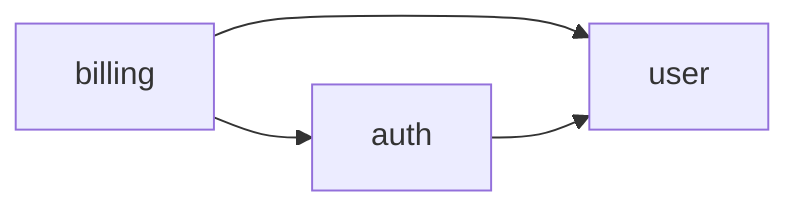
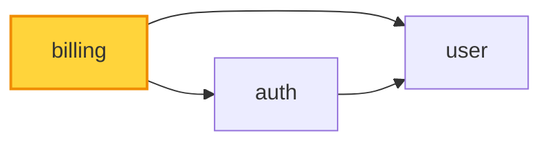
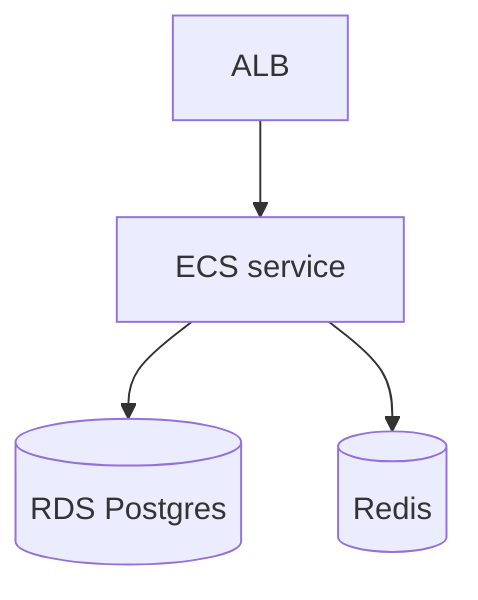
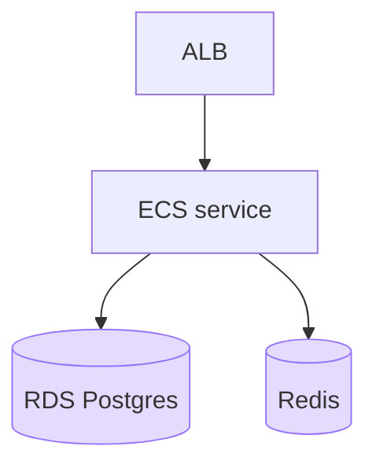

# Semantic Color in Diagrams Implementation Plan

> **For agentic workers:** REQUIRED SUB-SKILL: Use superpowers:subagent-driven-development (recommended) or superpowers:executing-plans to implement this plan task-by-task. Steps use checkbox (`- [ ]`) syntax for tracking.

**Goal:** Give every diagram one canonical semantic color vocabulary (6 roles) from a single `PALETTE`, applied via a d2 `classes` prelude injected at render time and matching mermaid `classDef`s.

**Architecture:** A new `src/diagram-colors.ts` is the single source of truth: `PALETTE` generates both `D2_CLASS_PRELUDE` (prepended to every d2 source in `renderViaD2`) and `MERMAID_CLASSDEFS`. Producers (`dep-graph`, `api-diagram`, `prisma-schema`) stop hand-rolling fills and apply canonical class names; the catalog documents the vocabulary and colors representative recipes. Color carries on the d2 floor for all kinds, and into the editable Excalidraw scene for flowchart/architecture mermaid (verified).

**Tech Stack:** TypeScript (NodeNext ESM, `.js` import specifiers), vitest, the `d2` binary (theme 0 + `--sketch`), mermaid classDefs.

---

## File Structure

- `src/diagram-colors.ts` — **create.** `PALETTE`, generated `D2_CLASS_PRELUDE`, `MERMAID_CLASSDEFS`.
- `src/render-diagram.ts` — **modify.** Prepend `D2_CLASS_PRELUDE` in `renderViaD2`.
- `src/dep-graph.ts`, `src/api-diagram.ts`, `src/prisma-schema.ts` — **modify.** Canonical classes.
- `skills/shared/diagrams.md` — **modify.** Color-vocabulary section + colored recipes.
- `skills/visual-recap/SKILL.md`, `skills/visual-plan/SKILL.md` — **modify.** Pointer to the vocabulary.
- `test/diagram-colors.test.ts` — **create.** Plus updates to render-diagram / producer / catalog tests.

---

## Task 1: `diagram-colors.ts` + d2 prelude injection

**Files:**
- Create: `src/diagram-colors.ts`
- Modify: `src/render-diagram.ts` (`renderViaD2`, ~lines 125-134)
- Create: `test/diagram-colors.test.ts`
- Modify: `test/render-diagram.test.ts`

- [ ] **Step 1: Write the failing tests**

Create `test/diagram-colors.test.ts`:

```ts
import { describe, it, expect } from "vitest";
import { PALETTE, D2_CLASS_PRELUDE, MERMAID_CLASSDEFS } from "../src/diagram-colors.js";
import { renderDiagram } from "../src/render-diagram.js";
import type { DiagramBlock } from "../src/blocks.js";

describe("diagram colors", () => {
  it("PALETTE has the six semantic roles", () => {
    expect(Object.keys(PALETTE).sort()).toEqual(
      ["actor", "added", "changed", "external", "removed", "store"],
    );
  });

  it("both generated strings reference every role with the PALETTE hex", () => {
    for (const [role, { fill }] of Object.entries(PALETTE)) {
      expect(D2_CLASS_PRELUDE).toContain(`${role}: {`);
      expect(D2_CLASS_PRELUDE).toContain(fill);
      expect(MERMAID_CLASSDEFS).toContain(`classDef ${role}`);
      expect(MERMAID_CLASSDEFS).toContain(fill);
    }
  });

  it("the injected prelude makes a `class: changed` diagram render the role's fill", async () => {
    const block: DiagramBlock = {
      type: "diagram", id: "c", title: "c", kind: "flowchart", d2: "x: { class: changed }",
    };
    const out = await renderDiagram(block, { excalidraw: false });
    expect(out.svg).toMatch(/<svg/);
    expect(out.svg.toLowerCase()).toContain("ffd43b"); // PALETTE.changed.fill
  }, 30_000);
});
```

Then append to `test/render-diagram.test.ts` (inside the existing `describe("renderDiagram (D2 floor)", ...)` block):

```ts
  it("injects the color prelude so a class resolves, and leaves class-less diagrams intact", async () => {
    const colored = await renderDiagram(
      { type: "diagram", id: "k", title: "k", kind: "flowchart", d2: "n: { class: external }" },
      { excalidraw: false },
    );
    expect(colored.svg.toLowerCase()).toContain("f1f3f5"); // external fill
    const plain = await renderDiagram(
      { type: "diagram", id: "p", title: "p", kind: "flowchart", d2: "a -> b" },
      { excalidraw: false },
    );
    expect(plain.svg).toMatch(/<svg/); // prelude is harmless when unused
  }, 30_000);
```

- [ ] **Step 2: Run the tests to verify they fail**

Run: `npm test -- diagram-colors` and `npm test -- render-diagram`
Expected: FAIL — `src/diagram-colors.ts` does not exist; the prelude isn't injected so `class:` doesn't resolve to a fill.

- [ ] **Step 3: Create `src/diagram-colors.ts`**

```ts
// Single source of truth for the semantic diagram palette. PALETTE drives both the d2
// `classes` prelude (injected into every render) and the matching mermaid classDefs, so the
// two representations can never drift. "changed" is bold (the subject pops); the rest are soft.
export type ColorRole = "changed" | "added" | "removed" | "actor" | "external" | "store";

export const PALETTE: Record<ColorRole, { fill: string; stroke: string; bold?: boolean }> = {
  changed: { fill: "#ffd43b", stroke: "#f08c00", bold: true },
  added: { fill: "#d3f9d8", stroke: "#37b24d" },
  removed: { fill: "#ffe3e3", stroke: "#f03e3e" },
  actor: { fill: "#d0ebff", stroke: "#4dabf7" },
  external: { fill: "#f1f3f5", stroke: "#adb5bd" },
  store: { fill: "#e5dbff", stroke: "#9775fa" },
};

const ROLES = Object.keys(PALETTE) as ColorRole[];

/** d2 `classes {}` block prepended to every diagram so recipes can apply `class: <role>`. */
export const D2_CLASS_PRELUDE: string = [
  "classes: {",
  ...ROLES.map((r) => {
    const { fill, stroke, bold } = PALETTE[r];
    const sw = bold ? "; stroke-width: 2" : "";
    return `  ${r}: { style: { fill: "${fill}"; stroke: "${stroke}"${sw} } }`;
  }),
  "}",
].join("\n");

/** Matching mermaid classDefs. Include in a flowchart/graph mermaid (+ `class X <role>;`) to keep
 *  the editable Excalidraw scene colored (verified: classDef fills convert to native elements). */
export const MERMAID_CLASSDEFS: string = ROLES.map((r) => {
  const { fill, stroke, bold } = PALETTE[r];
  const sw = bold ? ",stroke-width:2px" : "";
  return `classDef ${r} fill:${fill},stroke:${stroke}${sw};`;
}).join("\n");
```

- [ ] **Step 4: Inject the prelude in `renderViaD2`**

In `src/render-diagram.ts`, add the import near the top (with the other imports):

```ts
import { D2_CLASS_PRELUDE } from "./diagram-colors.js";
```

Then in `renderViaD2`, change the source write. Replace:

```ts
    await writeFile(inFile, source);
```

with:

```ts
    // Prepend the shared semantic-color classes so any diagram can apply `class: <role>`.
    await writeFile(inFile, `${D2_CLASS_PRELUDE}\n${source}`);
```

- [ ] **Step 5: Run the tests to verify they pass**

Run: `npm test -- diagram-colors`, `npm test -- render-diagram`, then `npm run typecheck`
Expected: PASS (new color tests + injection test; existing render-diagram tests still green); typecheck clean.

- [ ] **Step 6: Commit**

```bash
git add src/diagram-colors.ts src/render-diagram.ts test/diagram-colors.test.ts test/render-diagram.test.ts
git commit -m "feat: semantic color palette + injected d2 class prelude

Co-Authored-By: Claude Opus 4.8 (1M context) <noreply@anthropic.com>"
```

---

## Task 2: Consolidate the producers onto canonical classes

**Files:**
- Modify: `src/dep-graph.ts`, `src/api-diagram.ts`, `src/prisma-schema.ts`
- Test: `test/dep-graph.test.ts`, `test/api-diagram.test.ts`, `test/prisma-schema.test.ts`

- [ ] **Step 1: Update the failing tests**

(a) `test/dep-graph.test.ts` — replace the assertion `expect(block!.d2).toContain("style.fill");` with:

```ts
      expect(block!.d2).toContain("class: changed");
      expect(block!.mermaid!).toContain("classDef changed");
```

(b) `test/api-diagram.test.ts` — replace `expect(block.d2).toContain("style.fill");` with:

```ts
    expect(block.d2).toContain("class:");
    expect(block.mermaid).toContain("classDef");
```

(c) `test/prisma-schema.test.ts` — add this test (the file already imports `schemaDiffToBlock`; if not, add it to the import from `../src/prisma-schema.js`):

```ts
  it("marks changed tables with the canonical 'changed' class", () => {
    const block = schemaDiffToBlock([
      { model: "User", addedFields: [{ name: "email", type: "String" }], removedFields: [], keptFields: [{ name: "id", type: "Int" }] },
    ]);
    expect(block.d2).toContain("class: changed");
  });
```

- [ ] **Step 2: Run the tests to verify they fail**

Run: `npm test -- dep-graph`, `npm test -- api-diagram`, `npm test -- prisma-schema`
Expected: FAIL — producers still emit `style.fill` / no `class:`.

- [ ] **Step 3: Refactor `dep-graph.ts`**

In `src/dep-graph.ts`, add the import near the top:

```ts
import { MERMAID_CLASSDEFS } from "./diagram-colors.js";
```

Change the changed-node d2 line. Replace:

```ts
    lines.push(n.changed ? `${q(n.label)}: { style.fill: "#e6ffec" }` : q(n.label));
```

with:

```ts
    lines.push(n.changed ? `${q(n.label)}: { class: changed }` : q(n.label));
```

Then change the mermaid classDef. Replace:

```ts
  if (changedMids.length) {
    mlines.push("classDef changed fill:#e6ffec;");
    for (const m of changedMids) mlines.push(`  class ${m} changed;`);
  }
```

with:

```ts
  if (changedMids.length) {
    mlines.push(MERMAID_CLASSDEFS);
    for (const m of changedMids) mlines.push(`  class ${m} changed;`);
  }
```

- [ ] **Step 4: Refactor `api-diagram.ts`**

In `src/api-diagram.ts`, add the import and remove the local `FILL` map. Replace:

```ts
import type { ApiProcedure, DiagramBlock } from "./blocks.js";

const FILL: Record<string, string> = {
  added: "#e6ffec",
  removed: "#ffebe9",
  changed: "#fffdf3",
};
```

with:

```ts
import type { ApiProcedure, DiagramBlock } from "./blocks.js";
import { MERMAID_CLASSDEFS } from "./diagram-colors.js";
```

Change the d2 procedure line. Replace:

```ts
      lines.push(
        change && FILL[change]
          ? `  ${q(proc)}: { style.fill: ${q(FILL[change])} }`
          : `  ${q(proc)}`,
      );
```

with:

```ts
      lines.push(
        change
          ? `  ${q(proc)}: { class: ${change} }`
          : `  ${q(proc)}`,
      );
```

Change the mermaid class assignment guard. Replace:

```ts
      if (change && FILL[change]) classes.push(`  class ${nid} ${change};`);
```

with:

```ts
      if (change) classes.push(`  class ${nid} ${change};`);
```

Replace the three hand-written classDef lines:

```ts
  m.push("classDef added fill:#e6ffec;");
  m.push("classDef removed fill:#ffebe9;");
  m.push("classDef changed fill:#fffdf3;");
  m.push(...classes);
```

with:

```ts
  m.push(MERMAID_CLASSDEFS);
  m.push(...classes);
```

(`change` values are `"added" | "removed" | "changed"` — all canonical roles — so `class: ${change}` is always valid.)

- [ ] **Step 5: Refactor `prisma-schema.ts`**

In `src/prisma-schema.ts`, color the changed tables. In `schemaDiffToBlock`, replace:

```ts
    return `${d.model}: {\n  shape: sql_table\n${rows.join("\n")}\n}`;
```

with:

```ts
    return `${d.model}: {\n  shape: sql_table\n  class: changed\n${rows.join("\n")}\n}`;
```

(Every model in `diffs` is a changed model, so they all take the `changed` class. The empty-state
fallback table is left uncolored.)

- [ ] **Step 6: Run the tests to verify they pass**

Run: `npm test -- dep-graph`, `npm test -- api-diagram`, `npm test -- prisma-schema`, then `npm test` (full), then `npm run typecheck`.
Expected: PASS everywhere (producers now emit canonical classes; the diagrams still compile through the injected prelude). Run `git status --short` and confirm no stray `*.excalidraw` files.

- [ ] **Step 7: Commit**

```bash
git add src/dep-graph.ts src/api-diagram.ts src/prisma-schema.ts test/dep-graph.test.ts test/api-diagram.test.ts test/prisma-schema.test.ts
git commit -m "feat: producers use the canonical semantic color classes

Co-Authored-By: Claude Opus 4.8 (1M context) <noreply@anthropic.com>"
```

---

## Task 3: Catalog color vocabulary + colored recipes + guidance

**Files:**
- Modify: `skills/shared/diagrams.md`
- Modify: `skills/visual-recap/SKILL.md`, `skills/visual-plan/SKILL.md`
- Test: `test/diagram-catalog.test.ts`

- [ ] **Step 1: Write the failing test**

In `test/diagram-catalog.test.ts`, add these assertions as a new `it(...)` inside the existing
`describe("diagram catalog", ...)` block:

```ts
  it("documents the color vocabulary and applies a class in at least one recipe", () => {
    expect(catalog).toContain("Color vocabulary");
    expect(catalog).toMatch(/class:\s*(changed|added|removed|actor|external|store)/);
  });
```

- [ ] **Step 2: Run the test to verify it fails**

Run: `npm test -- diagram-catalog`
Expected: FAIL — the catalog has no "Color vocabulary" section and no recipe applies a `class:` yet.

- [ ] **Step 3: Add the Color vocabulary section to the catalog**

In `skills/shared/diagrams.md`, add this section immediately after the existing "## Authoring notes"
section (before the `<!-- catalog-entries-start -->` marker):

```markdown
## Color vocabulary

Diagrams carry a shared semantic palette (auto-injected — recipes only *apply* classes, never
define a `classes {}` block). Apply a role with `nodeName.class: <role>` (d2). For an
editable-eligible **flowchart/architecture** diagram, also color the editable Excalidraw scene by
adding the matching mermaid `classDef` + `class X <role>;` (copy from below). Sequence-diagram
coloring is d2-floor only (mermaid sequence has no class mechanism).

| role | meaning | d2 |
|---|---|---|
| `changed` | modified / the subject (bold amber) | `n.class: changed` |
| `added` | new (green) | `n.class: added` |
| `removed` | deleted (red) | `n.class: removed` |
| `actor` | user / initiator (blue) | `n.class: actor` |
| `external` | third-party system (gray) | `n.class: external` |
| `store` | datastore — db/cache/queue (violet) | `n.class: store` |

Mermaid classDefs (for editable flowchart/architecture diagrams):

    classDef changed fill:#ffd43b,stroke:#f08c00,stroke-width:2px;
    classDef added fill:#d3f9d8,stroke:#37b24d;
    classDef removed fill:#ffe3e3,stroke:#f03e3e;
    classDef actor fill:#d0ebff,stroke:#4dabf7;
    classDef external fill:#f1f3f5,stroke:#adb5bd;
    classDef store fill:#e5dbff,stroke:#9775fa;

Apply color where it clarifies — always mark the `changed` subject; tag actors / external systems /
datastores by role. Don't color every node; uncolored = neutral/unchanged.
```

- [ ] **Step 4: Color three representative recipes**

In `skills/shared/diagrams.md`:

(a) **Dependency graph** — replace its d2 block:

```d2
direction: right
billing -> user
billing -> auth
auth -> user
```

with:

```d2
direction: right
billing: { class: changed }
billing -> user
billing -> auth
auth -> user
```

and replace its mermaid block:



with:



(b) **Deployment / infra** — replace its d2 block:

```d2
"ALB" -> "ECS service": HTTPS
"ECS service" -> "RDS (Postgres)": SQL
"ECS service" -> "Redis": cache
```

with:

```d2
"RDS (Postgres)": { class: store }
"Redis": { class: store }
"ALB" -> "ECS service": HTTPS
"ECS service" -> "RDS (Postgres)": SQL
"ECS service" -> "Redis": cache
```

and replace its mermaid block:



with:



(c) **Sequence** (d2-floor color only) — replace its d2 block:

```d2
shape: sequence_diagram
client -> api: captureOrder(id)
api -> paypal: capture(id)
paypal -> api: ok
api -> client: order
```

with:

```d2
shape: sequence_diagram
client: { class: actor }
paypal: { class: external }
client -> api: captureOrder(id)
api -> paypal: capture(id)
paypal -> api: ok
api -> client: order
```

(Leave the Sequence recipe's mermaid unchanged — mermaid sequence has no classDef mechanism.)

- [ ] **Step 5: Add a guidance pointer to both skills**

In `skills/visual-recap/SKILL.md`, in the "### Which diagram(s) to add" section, after the line
"Use the catalog's recipes verbatim (they are compile-tested), substituting real identifiers.",
add:

```markdown
Apply the catalog's **color vocabulary** — always mark the `changed` subject, and tag actors /
external systems / datastores by role so the diagram reads at a glance.
```

In `skills/visual-plan/SKILL.md`, after the catalog-pointer line under `## Content -> block mapping`
("For diagram selection … consult the shared catalog: …"), add:

```markdown
Color diagrams with the catalog's semantic palette (the "Color vocabulary" section) — mark the
`changed`/subject node and tag actors / external systems / datastores by role.
```

- [ ] **Step 6: Run the test + full suite + typecheck**

Run: `npm test -- diagram-catalog`, then `npm test`, then `npm run typecheck`.
Expected: PASS — the new catalog test passes; every recipe (now including the colored ones) still
compiles through the injected prelude; mermaid lint still passes (classDef lines follow a valid
`flowchart` header); full suite green; typecheck clean.

- [ ] **Step 7: Commit**

```bash
git add skills/shared/diagrams.md skills/visual-recap/SKILL.md skills/visual-plan/SKILL.md test/diagram-catalog.test.ts
git commit -m "docs: catalog color vocabulary + colored recipes + skill guidance

Co-Authored-By: Claude Opus 4.8 (1M context) <noreply@anthropic.com>"
```

---

## Final verification (after all tasks)

- [ ] `npm test` — all green (incl. diagram-colors + updated producer/catalog tests).
- [ ] `npm run typecheck` — clean.
- [ ] Manual smoke (d2 floor): regenerate a recap (`npx tsx bin/recap.ts --repo <repo> --commit <sha> --out /tmp/color-demo`), open `/tmp/color-demo/recap.html`, and confirm the where-it-fits changed node is bold amber and the API-surface added/removed procedures are green/red.
- [ ] Manual smoke (editable, opt-in): with `npm run setup:excalidraw` installed, render a flowchart/architecture diagram that carries the mermaid classDefs and confirm the `.excalidraw` scene opens with the role colors (not monochrome).
