# Diagram Catalog

Shared selection guide + tested recipes for the `visual-plan` and `visual-recap` skills. Every
recipe's `d2` is the dependable render floor; entries marked **editable: yes** also carry a
`mermaid` source so the optional Excalidraw upgrade produces an editable scene.

Pick the **fewest** diagrams that explain the change. One strong diagram beats three weak ones.
When 2–3 different lenses each add distinct value, present them in a `tabs` block rather than
forcing one. Ground every node label in real identifiers from the target repo.

For the **visual-spec** page's HTML/CSS section components (TL;DR, big-idea, anatomy explainer,
component cards, decision cards, rollout, approval band) and its hand-authored info-flow SVG hero,
see the sibling [Spec-Component Catalog](spec-components.md).

## Selection guide

**Structure — what exists**
- *Dependency graph* — modules as nodes, imports as arrows; surfaces coupling and cycles. (This
  is also produced mechanically as the recap's `where-it-fits` diagram.)
- *Deployment / infra* — what runs where (ALB, ECS, RDS, Redis…).

**Behavior — what happens at runtime**
- *Sequence* — collaborators on lifelines, time downward; ONE scenario, multi-collaborator path.
- *State machine* — an entity in one of N bounded states with labeled transitions.

**Boundaries — what is separated**
- *Bounded-context map (DDD)* — domain boundaries and the contracts at their seams.
- *API surface* — what a service exposes / consumes. (Also a mechanical recap producer.)

**Data flow — how information moves**
- *Data-flow* — sources → transformations → sinks. (ETL/pipeline is the same shape staged.)
- *Event / pub-sub topology* — publishers, topics, subscribers.

**Operations — how things fail and recover**
- *CI / build pipeline* — commit → deploy stages.
- *Blast-radius / failure-mode* — what falls over if X dies.

**C4 ladder — zoom levels** (context → container → component). The *code* level (class diagram
for one component) is rarely worth drawing — use the `class` kind directly if ever needed.

**Journey — branching work**
- *Decomposition* — happy path as one flow, each major edge case branching off. Most-used.
- *Swimlane / activity* — lanes by actor (customer / frontend / backend / external).

**Tie-breakers**
- Branching driven by handoffs between actors → **swimlane**.
- Branching driven by an entity's bounded state → **state machine**.
- Genuinely tree-shaped with no rejoining paths → a state-machine/decomposition variant.

**Out of scope** (stakeholder/discovery formats, not engineering deliverables — do not attempt):
journey maps (UX phases/emotions), BPMN gateway notation, event storming sticky-notes.

## Authoring notes

- `d2` is required and is the floor. Quote any d2 key/value containing a dot or space.
- Only `flowchart`/`graph`, `sequenceDiagram`, and `classDiagram` mermaid convert to *editable*
  Excalidraw elements. `stateDiagram` and `erDiagram` rasterize — so author a **state machine as
  a mermaid `flowchart`** (states as nodes, transitions as labeled edges), never `stateDiagram`.
- **Keep mermaid edge/pipe labels free of parentheses and brackets** — `A -->|sqrt(1-p) loading| B`
  fails to parse (mermaid reads `(` / `[` as a node-shape opener), which silently drops the editable
  Excalidraw upgrade to a static image. Reword to `A -->|sqrt 1-p loading| B`. Unicode math
  (`√ ρ ε ≈`) is fine; the punctuation is the problem. (d2 labels are unaffected.)
- **Mermaid: a `/` right after `[` opens a parallelogram shape.** `cron[/api/cron/sync]` or
  `http[/api/trpc route]` is read as a slanted-node opener and fails to parse. For label text that
  starts with or contains a leading slash (route paths, file paths), wrap it in quotes:
  `cron["/api/cron/sync"]`.
- **d2: a literal `$` in a label throws `substitutions must begin on {`.** `proj: "projected $"`
  fails — d2 treats `$` as a substitution sigil. Drop or word it (`"projected value"`), or escape as
  needed. (mermaid labels are unaffected.)
- An invalid diagram degrades to a visible placeholder rather than breaking the document.

## Color vocabulary

Diagrams carry a shared semantic palette (auto-injected — recipes only *apply* classes, never
define a `classes {}` block). Apply a role with `nodeName.class: <role>` (d2). For an
editable-eligible **flowchart/architecture** diagram, also color the editable Excalidraw scene by
adding the matching mermaid `classDef` + `class X <role>;` (copy from below). Sequence-diagram
coloring is d2-floor only (mermaid sequence has no class mechanism).

| role | meaning | d2 |
|---|---|---|
| `changed` | modified / the subject (bold amber) | `n.class: changed` |
| `added` | new (green) | `n.class: added` |
| `removed` | deleted (red) | `n.class: removed` |
| `actor` | user / initiator (blue) | `n.class: actor` |
| `external` | third-party system (gray) | `n.class: external` |
| `store` | datastore — db/cache/queue (violet) | `n.class: store` |

Mermaid classDefs (for editable flowchart/architecture diagrams):

    classDef changed fill:#ffd43b,stroke:#f08c00,color:#1b1b1b,stroke-width:2px;
    classDef added fill:#d3f9d8,stroke:#37b24d,color:#1b1b1b;
    classDef removed fill:#ffe3e3,stroke:#f03e3e,color:#1b1b1b;
    classDef actor fill:#d0ebff,stroke:#4dabf7,color:#1b1b1b;
    classDef external fill:#f1f3f5,stroke:#adb5bd,color:#1b1b1b;
    classDef store fill:#e5dbff,stroke:#9775fa,color:#1b1b1b;

A compact legend is rendered automatically beneath any diagram that applies these roles
(listing only the roles used), so you don't need to author one — just apply the classes.

Apply color where it clarifies — always mark the `changed` subject; tag actors / external systems /
datastores by role. Don't color every node; uncolored = neutral/unchanged.

<!-- catalog-entries-start -->

### Feature home (layered stack)
- **kind:** `architecture` — **editable:** yes
- **Use when:** orienting *where a change lives* — the changed pieces in their layered stack
  (router → service → repository → datastore), with reused existing modules called out. The curated
  replacement for the recap's mechanical `where-it-fits` import graph (use the same `where-it-fits`
  id). Mark new pieces `changed`; leave reused/existing modules neutral; tag the datastore `store`.
- **Avoid when:** a single-file change with no meaningful layering (drop the structural diagram).

```d2
direction: right
"procedure (router, new)": { class: changed }
"service method (new)": { class: changed }
"repo query (new)": { class: changed }
"existing dep (reused)"
"Postgres": { class: store }
"procedure (router, new)" -> "service method (new)"
"service method (new)" -> "existing dep (reused)": reuse
"service method (new)" -> "repo query (new)"
"repo query (new)" -> "Postgres": query
```

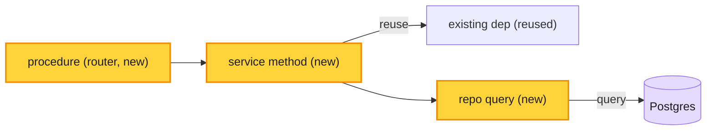

### Dependency graph
- **kind:** `architecture` — **editable:** yes
- **Use when:** showing how the changed module sits among its importers/imports; spotting cycles.
- **Avoid when:** the relationship is a runtime call sequence (use Sequence instead).
- Module-boundary diagrams (internal package/namespace seams) are the same shape at a finer grain.

```d2
direction: right
billing: { class: changed }
billing -> user
billing -> auth
auth -> user
```

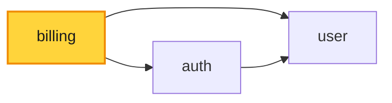

### Deployment / infra
- **kind:** `architecture` — **editable:** yes
- **Use when:** the change touches what runs where (a new queue, cache, managed service).
- **Avoid when:** nothing about the topology changed.

```d2
"RDS (Postgres)": { class: store }
"Redis": { class: store }
"ALB" -> "ECS service": HTTPS
"ECS service" -> "RDS (Postgres)": SQL
"ECS service" -> "Redis": cache
```

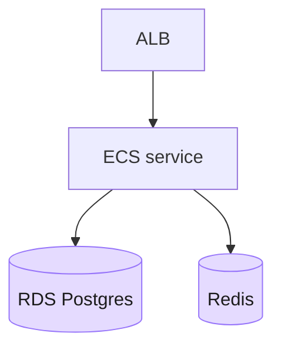

### Sequence
- **kind:** `sequence` — **editable:** yes
- **Use when:** the change adds/alters a multi-collaborator runtime path (request flow, integration call chain).
- **Avoid when:** there is only one actor, or order doesn't matter.

```d2
shape: sequence_diagram
client: { class: actor }
paypal: { class: external }
client -> api: captureOrder(id)
api -> paypal: capture(id)
paypal -> api: ok
api -> client: order
```

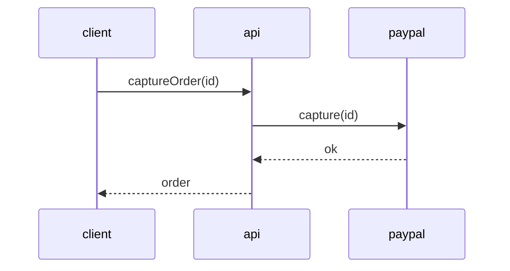

### State machine
- **kind:** `flowchart` — **editable:** yes
- **Use when:** an entity moves through bounded states (subscription, checkout, signup).
- **Avoid when:** there are no real states, just a linear flow.
- Authored as a `flowchart` (NOT `stateDiagram`) so it stays editable.

```d2
direction: right
PENDING -> PAID: capture
PENDING -> CANCELLED: cancel
PAID -> REFUNDED: refund
```

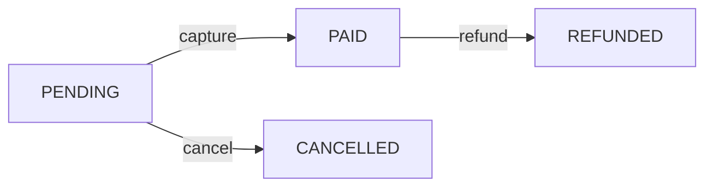

### Bounded-context map
- **kind:** `architecture` — **editable:** yes
- **Use when:** showing domain boundaries and the contracts (ACL, shared kernel) at their seams.
- **Avoid when:** the system is a single context.

```d2
"Billing" -> "Identity": "customer id (ACL)"
"Catalog" -> "Billing": "price (shared kernel)"
```

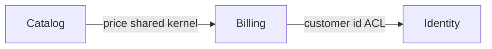

### API surface
- **kind:** `architecture` — **editable:** yes
- **Use when:** showing what a service/router exposes and who consumes it.
- **Avoid when:** the recap's mechanical api-surface diagram already covers it.

```d2
"web app" -> "league router"
"league router": {
  list
  create
}
```

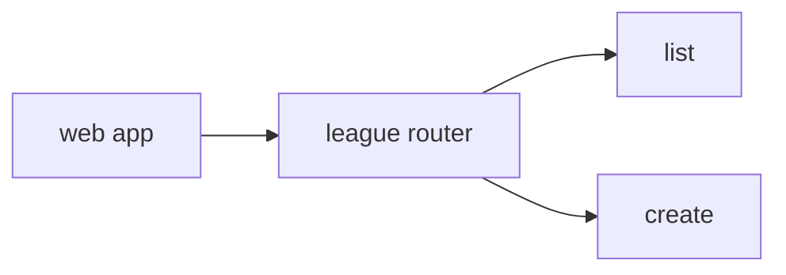

### Data-flow
- **kind:** `architecture` — **editable:** yes
- **Use when:** tracing how data is sourced, transformed, and stored. ETL/streaming pipelines are
  the same shape with explicit stages.
- **Avoid when:** there is no transformation, just a single read/write.

```d2
"CSV upload" -> "validator" -> "normalizer" -> "Postgres"
"normalizer" -> "metrics sink"
```

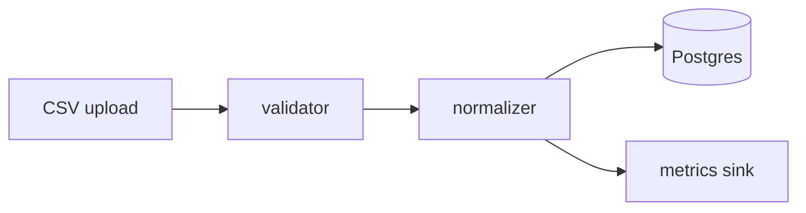

### Event / pub-sub topology
- **kind:** `architecture` — **editable:** yes
- **Use when:** the change adds a publisher, topic, or subscriber.
- **Avoid when:** the call is synchronous (use Sequence).

```d2
"OrderService" -> "orders.created": publish
"orders.created" -> "EmailWorker": subscribe
"orders.created" -> "AnalyticsWorker": subscribe
```

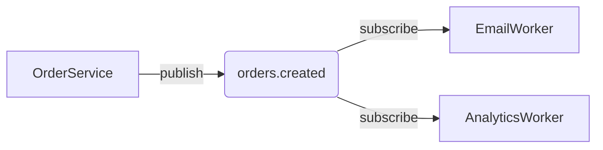

### CI / build pipeline
- **kind:** `flowchart` — **editable:** yes
- **Use when:** the change alters how code goes from commit to deploy.
- **Avoid when:** CI is unchanged.

```d2
direction: right
commit -> build -> test -> "deploy staging" -> "deploy prod"
```

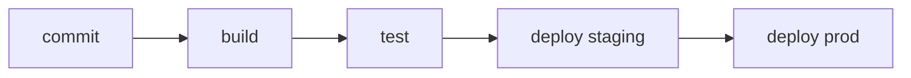

### Blast-radius / failure-mode
- **kind:** `architecture` — **editable:** yes
- **Use when:** explaining what fails downstream if a dependency dies.
- **Avoid when:** the change has no new failure dependency.

```d2
"Redis down" -> "session reads fail"
"Redis down" -> "rate limiter fails open"
"session reads fail" -> "users logged out"
```

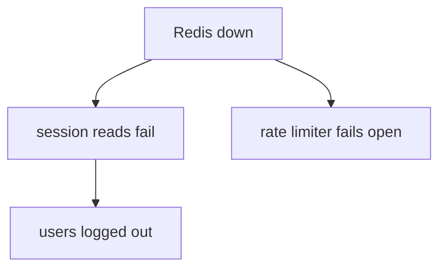

### C4 context
- **kind:** `architecture` — **editable:** yes
- **Use when:** the highest zoom — the system as one box plus its users and external systems.
- **Avoid when:** the reader needs internals — drop a zoom level to C4 container/component.

```d2
"Customer" -> "PPGL system": uses
"PPGL system" -> "PayPal": payments
"PPGL system" -> "Email provider": mail
```

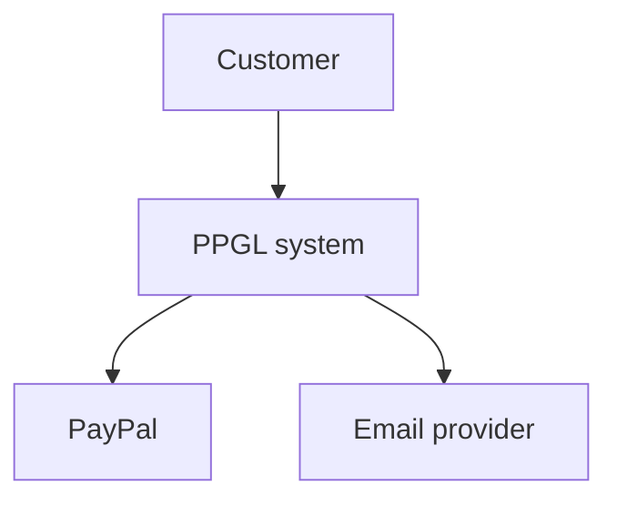

### C4 container
- **kind:** `architecture` — **editable:** yes
- **Use when:** the separately-deployable things inside the system (web app, API, DB, worker).

```d2
"Web app (Next.js)" -> "API (tRPC)": "JSON/HTTPS"
"API (tRPC)" -> "Postgres": Prisma
"API (tRPC)" -> "Worker": queue
```

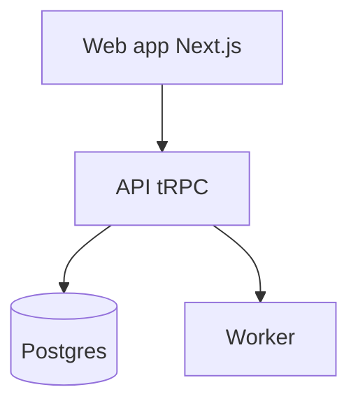

### C4 component
- **kind:** `architecture` — **editable:** yes
- **Use when:** the major internal pieces of one container (controllers, services, repositories).

```d2
"league router" -> "LeagueService"
"LeagueService" -> "LeagueRepository"
"LeagueService" -> "PayPalClient"
```

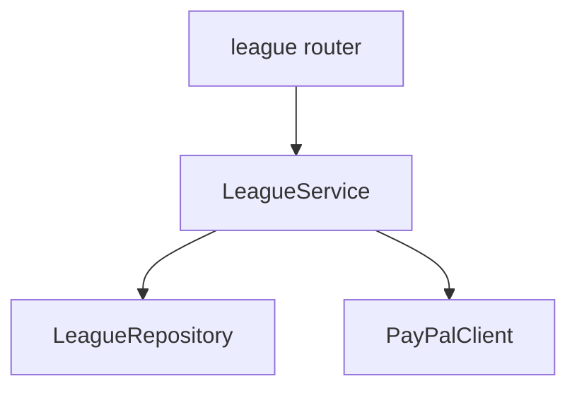

### Decomposition
- **kind:** `flowchart` — **editable:** yes
- **Use when:** a journey with a happy path plus a few named edge cases.
- **Avoid when:** the branching is state-driven (use State machine) or actor-driven (use Swimlane).

```d2
direction: right
start -> validate -> charge -> confirm
validate -> "reject: invalid"
charge -> "retry: gateway error"
```

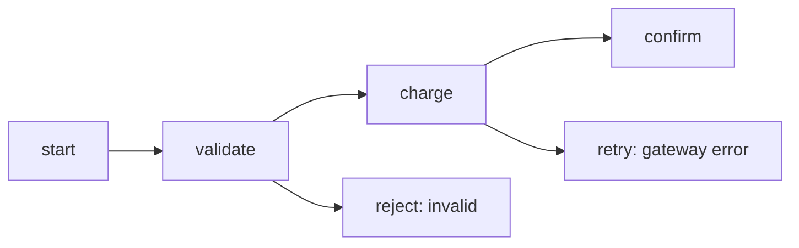

### Swimlane / activity
- **kind:** `flowchart` — **editable:** yes
- **Use when:** branching is driven by handoffs between actors.
- **Avoid when:** there's a single actor.

```d2
Customer.pay -> Frontend.submit
Frontend.submit -> Backend.capture
Backend.capture -> External.paypal
```

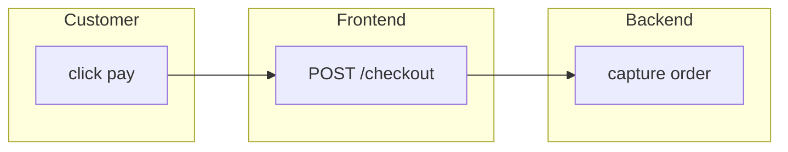

### ERD / schema
- **kind:** `erd` — **editable:** no
- **Use when:** showing entities and relations. (The recap produces this mechanically from a
  Prisma diff.) Stays static — ER mermaid rasterizes in Excalidraw, so no mermaid here.

```d2
User: {
  shape: sql_table
  id: int
  email: string
}
Order: {
  shape: sql_table
  id: int
  user_id: int
}
Order.user_id -> User.id
```
